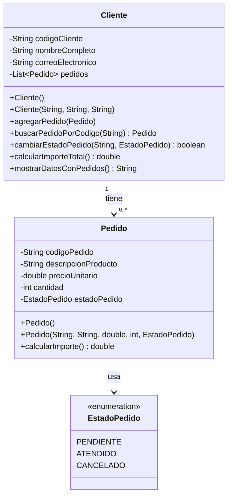

# Evaluacion-T1

Sistema de gestión de pedidos para una cafetería universitaria, implementado en Java.

## 1) Identificación de requerimientos (Historias de usuario)

- **HU1**: Como administrador, quiero registrar clientes con código, nombre y correo para identificar correctamente a cada persona.
- **HU2**: Como administrador, quiero agregar uno o varios pedidos por cliente para llevar el control de compras.
- **HU3**: Como administrador, quiero visualizar los datos de un cliente y todos sus pedidos para revisar su historial.
- **HU4**: Como administrador, quiero calcular el importe de cada pedido para conocer su costo individual.
- **HU5**: Como administrador, quiero calcular el importe total de pedidos de un cliente para conocer el monto acumulado.
- **HU6**: Como administrador, quiero buscar pedidos por código para acceder rápidamente a un pedido específico.
- **HU7**: Como administrador, quiero cambiar el estado de un pedido para reflejar su atención o cancelación.
- **HU8**: Como administrador, quiero validar datos de entrada para evitar registros inválidos o inconsistentes.

## 2) Clases y responsabilidades

### Clase `Cliente`
- **Atributos**: `codigoCliente`, `nombreCompleto`, `correoElectronico`, `pedidos` (`ArrayList<Pedido>`).
- **Responsabilidades**:
  - Gestionar los datos del cliente.
  - Agregar pedidos evitando códigos duplicados.
  - Buscar pedidos por código.
  - Cambiar estado de pedidos.
  - Calcular importe total.
  - Mostrar datos del cliente y sus pedidos.

### Clase `Pedido`
- **Atributos**: `codigoPedido`, `descripcionProducto`, `precioUnitario`, `cantidad`, `estadoPedido`.
- **Responsabilidades**:
  - Gestionar datos de un pedido.
  - Validar precio, cantidad y estado.
  - Calcular el importe (`precioUnitario * cantidad`).

### Enum `EstadoPedido`
- **Valores**: `PENDIENTE`, `ATENDIDO`, `CANCELADO`.
- **Responsabilidad**: restringir los estados válidos de un pedido.

### Clase `Main`
- **Responsabilidad**: demostrar las funcionalidades solicitadas mediante un flujo ejecutable.

## 3) Diagrama UML (texto)



## 4) Restricciones de negocio implementadas

- El código del cliente no puede estar vacío.
- El código del pedido no puede estar vacío.
- El código del pedido debe ser único dentro de cada cliente.
- El precio unitario y la cantidad deben ser mayores que cero.
- El estado del pedido se limita a `PENDIENTE`, `ATENDIDO` o `CANCELADO`.
- No se permiten pedidos duplicados por código.
- Los atributos están encapsulados (`private`) con constructores, getters y setters.

## 5) Estructura del proyecto

```text
src/
  Cliente.java
  Pedido.java
  EstadoPedido.java
  Main.java
```

## 6) Compilación y ejecución

Desde la raíz del repositorio:

```bash
javac src/*.java
java -cp src Main
```

## 7) Evidencia de control de versiones (ejemplo sugerido)

- commit 1: Estructura inicial del proyecto
- commit 2: Implementación de clase Pedido
- commit 3: Implementación de clase Cliente
- commit 4: Implementación de funcionalidades y Main
- commit 5: Validaciones y ajustes finales

